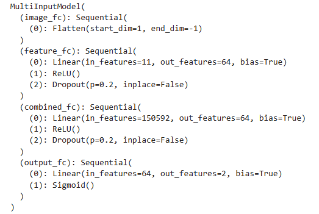
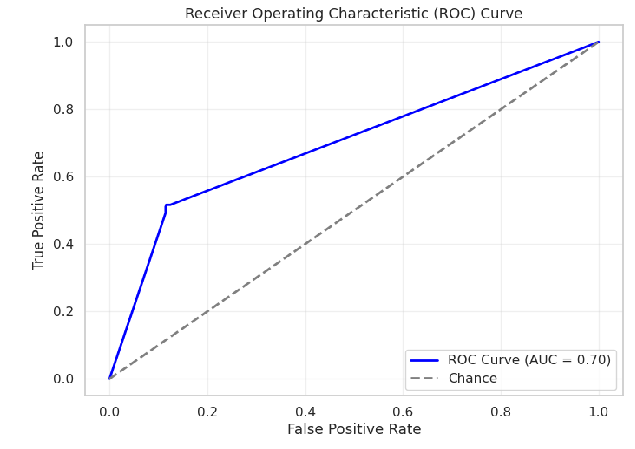

# Binary-Classification-of-globally-sclerotic-and-non-sclerotic-glomeruli-
For the completion of this task, I have taken inspiration from this Research Paper: https://pmc.ncbi.nlm.nih.gov/articles/PMC8765108/. This research paper provides two approaches for the binary classification task
1.	Using a Computer Aided Diagnosis system that leverages the potential of artificial intelligence
2.	The second approach involves in employing the IBM Watson Visual Recognition Systems

I have followed the first approach. In the research paper, the first approach implements a pipeline that extracts features describing input data and makes the classifications based on these features. The classification is then performed with a supervised ML algorithm, a shallow ANN. Their feature extraction process included extracting two morphological characteristics related to Bowman’s capsule and Bowman’s space. Along with this they extracted 148 textual features based on the multi-radial colour LBP and Haralick algorithms. Because of the number of their extracted features, they implemented PCA to reduce the number of textual features to 95. 

I have implemented a similar strategy just on a lower scale:

##  Data preprocessing:
1.	Loading the ‘public.csv’ using pandas as a dataframe
2.	Adding a new column in the dataframe ‘image_path’ that will store the path and the name of the image of the corresponding image in the row
3.	Removing the row with the truncated image
4.	Loading the ‘features’ numpy file and converting them into a pandas dataframe name ‘df_array’
5.	Concatenating both the dataframes and renaming the columns for better interpretability
6.	Scaling a few columns (f1,f2,f5,f6,f7)based Using the MinMaxScaler()
7.	Checking if any of the rows have NaN values

##  Data Visualization:
1.	Loading and displaying random images of both classes
2.	Plotting a bar chart to understand the distribution of classes, the aim was to determine how imbalanced/ biased the dataset was. The dataset was heavily biased towards class 0.

##  Feature Extraction Process:
I have extracted features in a different notebook, ‘Glormeruli_Image_feature_extraction’. Similar preprocessing steps (1-4) are applied on the csv file after importing it as mentioned in the ‘Data Preprocessing’ section. 
1.	Then using a custom image data generator, I have loaded the images in batches of size along with their labels.
2.	I have extracted two types of features: Morphological Characteristics, Textual features
3.	Morphological characteristics: It involved image segmentation and morphological analysis to quantify features such as area, perimeter, or shape descriptors.
4.	Textual features: For textual patterns I have extracted 8 features using Local Binary Patterns and Haralick algorithm.
I have extracted only a total of 11 features contrast to the 148 features extracted in the paper. This discrepancy probably arises because in their implementation they have most likely used an advanced version of Local Binary Pattern(LBP) algorithm, i.e Multi Radial Color Local Binary Pattern(mrcLBP) and possibly they have computed the Haralick features across multiple distances, angles or channels.

##  Defining the model:
1.	I have used Pytorch and it’s classes to build the model.
2.	Two inputs can be given to the model, the image and the corresponding features that are stored in the features.npy file
3.	It then combines both types of input.

   

##  Loading the data:
1.	I have used pytorch’s Dataset class to load both the features and images as input
2.	I have applied some transformation on the inputs like resizing, data augmentation, normalization and random scaling.
3.	Then the images are loaded along with the corresponding features and labels and the image, feature and labels are returned.
4.	Some important factors used to process and load the data:
- Data is split into 80% train, 20% test and 20% validation from training
- Batch_size used is 32
- Modified image size is (224*224)
5.	Shape and size of each set after loading the data using the CustomDataset class:
- Training samples: 3684
- Validation samples: 921
- Test samples: 1152
- Batch images shape: torch.Size([32, 3, 224, 224])
- Batch features shape: torch.Size([32, 11])
- Batch labels shape: torch.Size([32])

##  Training process:
1.	Loss function used is nn.CrossEntropyLoss(weight=class_weights), I have provided the weights of both classes as the dataset is heavily imbalanced.
2.	Optimizer used is Adam, learning rate is 5e-4.
3.	I have trained the model for 50 epochs.
4.	The metrics used are precision, recall and accuracy for both validation and training sets.

##  Performance Metrics:
The model's performance is evaluated based on accuracy, precision and recall. These metrics are chosen to provide a comprehensive understanding of the model's ability to classify sclerotic and non-sclerotic glomeruli accurately:
- Accuracy: 80%
- Precision: 47% 
- Recall: 56%
  
   

##   How to run the Model.ipynb

1. To run this notebook you need to provide the path of the public.csv, the two shared image folders path, feature.npy and labels.npy files, that should be present in the data folder in the repository.
2. The two numpy files which I have already uploaded in the data folder, contain textual and morphological features that I have already extracted from the given dataset using this notebook(Glormeruli_Image_feature_extraction.ipynb), you don't need to run it again.
3. You need to add to the two shared image folders and the public.csv in the data folder on the repository.
4. Once all the paths are updated in the config.yaml file you can directly run the notebook 

## Evaluation Script:
The evaluation script contains code for both feature extraction and model prediction. I have used two separate custom dataset generators for the two tasks. Then using the shared saved weights of my model you can test the model.

###  How to use the evaluation script:
1.	I have added a ‘config.yaml’ in the repository,I have given a relative path to it './data/...' change the path according to each file respectively, you need to provide the path to the public.csv, the two image folders and the model.pth file which is shared via the google drive.
2.	The public.csv file and the two image folders need to be added in the data folder on the repository and the model.pth shared file need to be added in the models folder.
3.	Based on the images that you provide, the code will generate a features.npy and a labels.npy file, which will be saved in the runtime.
4.	At the end of the execution, a ‘evaluation.csv’ file will be generated with the image name and the predicted value.
